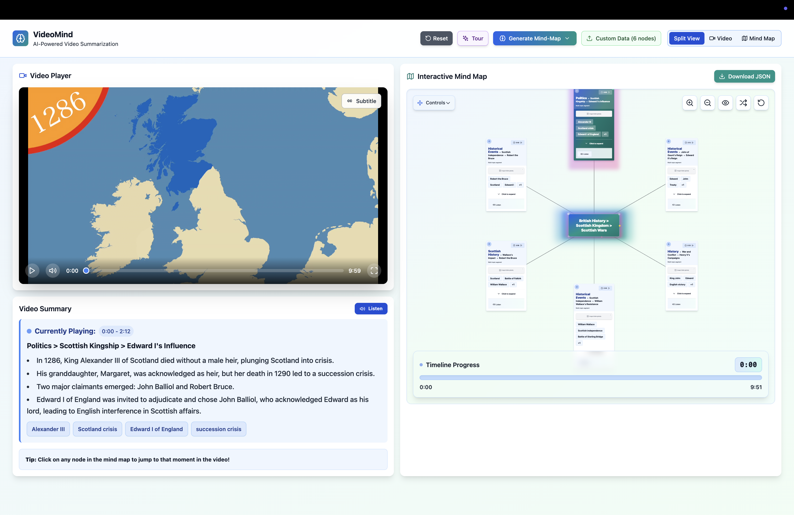

# VideoMind - AI-Powered Video Summarization Tool

VideoMind is an interactive web application that creates AI-powered mind maps from video content, helping users navigate and understand video content more efficiently through visual summaries, timestamps, and interactive exploration.





## Features

- **Interactive Mind Maps**: Visual representation of video content with clickable nodes
- **Video Synchronization**: Click on mind map nodes to jump to specific video timestamps
- **AI-Generated Summaries**: Automated extraction of key points and topics
- **Multiple View Modes**: Split view, video-only, and mind map-only modes
- **Text-to-Speech**: Listen to summaries and content
- **Subtitle Support**: Synchronized transcriptions with adjustable sizing
- **Responsive Design**: Works on desktop and mobile devices
- **Export Functionality**: Download mind maps as JSON files

## Responsible AI Use


### Content Disclaimer
- AI-generated content is supplementary and not a replacement for original video content
- Users should always refer to source material for complete accuracy
- Built-in warnings and disclaimers throughout the interface
- Transparency about AI limitations and potential errors

## Getting Started

### Prerequisites
- Node.js (v16 or higher)
- npm or yarn

### Installation

1. Clone the repository:
```bash
git clone <repository-url>
cd videomind
```

2. Install dependencies:
```bash
npm install
```

3. Start the development server:
```bash
npm run dev
```

4. Open your browser and navigate to `http://localhost:5173`

## Usage

### Basic Usage
1. **Accept Ethics Guidelines**: On first use, review and accept the responsible AI use guidelines
2. **Choose Content**: Use built-in demo data or upload your own JSON/video files
3. **Explore**: Click on mind map nodes to see detailed summaries and jump to video timestamps
4. **Navigate**: Use different view modes to focus on video or mind map content
5. **Export**: Download generated mind maps for future use

### Uploading Custom Content
1. Click "Generate Mind-Map" → "Upload JSON"
2. Upload both a JSON file (with mind map data) and corresponding video file
3. The JSON should follow the specified format (see Format Requirements in the upload modal)

### AI Generation (Requires API)
1. Click "Generate Mind-Map" → "AI Generate"
2. Upload a video file
3. The system will process the video and generate a mind map automatically
4. Download the results for future use

## Data Format

### JSON Structure
```json
{
  "root_topic": "Video Title",
  "transcription": [
    {"timestamp": [0.0, 5.0], "text": "Transcription text"}
  ],
  "nodes": [
    {
      "timestamp": [0.0, 10.0],
      "text": "Full content text",
      "summary": ["Summary point 1", "Summary point 2"],
      "keywords": ["keyword1", "keyword2"],
      "named_entities": [["Entity Name", "TYPE"]],
      "emojis": "🔬🧲",
      "best_image": "base64_encoded_image",
      "start_image": "base64_encoded_image",
      "topic": "Node Title",
      "tts": "base64_encoded_audio"
    }
  ]
}
```

## Ethics and Bias Reporting

### Reporting Issues
Users can report potential bias, inaccuracies, or inappropriate content through:
- Built-in reporting buttons throughout the interface
- Detailed context capture for better issue resolution
- Local storage of reports for development team review

### Best Practices
- Always apply critical thinking to AI-generated content
- Cross-reference important information with original sources
- Be aware of potential AI limitations and biases
- Use the tool as a supplement, not a replacement for original content

## Development

### Project Structure
```
src/
├── components/          # React components
├── data/               # Mock data and examples
├── hooks/              # Custom React hooks
├── types/              # TypeScript type definitions
├── utils/              # Utility functions
└── App.tsx            # Main application component
```

### Key Components
- `MindMap.tsx`: Interactive mind map visualization
- `VideoPlayer.tsx`: Video player with subtitle support
- `EthicsDisclaimer.tsx`: Responsible AI use guidelines
- `BiasReportModal.tsx`: Issue reporting system
- `AIContentWarning.tsx`: Content disclaimer component

### Building for Production
```bash
npm run build
```

## API Integration

The application supports integration with AI processing APIs for automatic mind map generation. Configure the API endpoint in your environment variables:

```env
VITE_API_BASE_URL=your_api_endpoint
```

## Contributing

1. Fork the repository
2. Create a feature branch
3. Make your changes following the established patterns
4. Test thoroughly, especially for bias and accessibility
5. Submit a pull request with detailed description

### Code Standards
- Follow existing TypeScript and React patterns
- Maintain accessibility standards (ARIA labels, keyboard navigation)
- Include bias considerations in new features
- Add appropriate error handling and user feedback

## License

This project is licensed under the MIT License - see the LICENSE file for details.

## Acknowledgments

- Built with React, TypeScript, and Tailwind CSS
- Uses Lucide React for icons
- Implements Web Speech API for text-to-speech functionality
- Designed with accessibility and responsible AI principles

## Support

For questions, issues, or suggestions:
- Use the built-in bias reporting system for AI-related concerns
- Check the GitHub issues page for known problems
- Review the ethics guidelines for responsible use information

---

**Important**: This tool generates AI-powered content that should be used as a supplementary aid only. Always refer to original video content for complete accuracy and context.
